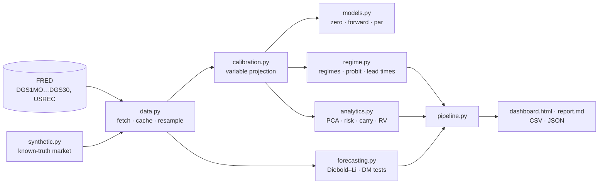

# NSS Yield Curve Engine

[](https://github.com/RblxDev-ALS/NSS-Yield-Curve-Engine/actions/workflows/ci.yml)
[](https://github.com/RblxDev-ALS/NSS-Yield-Curve-Engine/actions/workflows/live-dashboard.yml)


A Python engine that fits the **Nelson–Siegel–Svensson (NSS)** model to the U.S.
Treasury yield curve every week since 1990. It then uses the fitted curves to
measure the economy's position in the rate cycle, estimate recession risk,
forecast yields and price bond risk.

A yield curve is a set of numbers: what the government pays to borrow for
1 month, 3 months, … 30 years. The NSS model compresses that curve into six
parameters with economic meaning: the long-run **level** of rates, the **slope**
(long minus short, the famous recession signal), and two **curvature** terms.
Fitting those six numbers reliably, every week, is harder than it sounds. Most of
this project is about doing it robustly and proving that it works.

## Results on real Treasury data

From the latest run of the [live workflow](https://github.com/RblxDev-ALS/NSS-Yield-Curve-Engine/actions/workflows/live-dashboard.yml):
1,917 weekly curves, from January 1990 to 23 September 2026.

| | |
|---|---|
| Median fit error | **3.4 bp** (95th percentile 7.3 bp), 100% of fits converged |
| Calibration speed | ~12 ms per curve, so 36 years of weekly curves take about 35 s |
| Model-implied vs observed 10Y−3M spread | correlation **0.999**, mean absolute gap 5 bp |
| Inversions detected (≥ 3 months, 10Y−3M) | 2000, 2006, 2019: each followed by a recession after **8, 17 and 10 months**. 2022–24: the deepest inversion in the sample (−1.8 pp, 25 months), with no recession so far |
| Recession probit (12 months ahead) | $\Phi(-1.05 - 0.39\cdot\text{spread})$, AUC 0.78 |
| Diebold–Li forecasts vs random walk | the random walk **wins** at 1, 6 and 12 months (RMSE ratios 1.04–1.24) |

Two of these results are negative, and they are reported as such. **Forecasting**
yields beats "no change" in Diebold & Li's original 1985–2000 sample, but not
since. A model that mean-reverts to a historical average struggles through
decades of falling rates and the zero lower bound, and the random walk is
famously hard to beat in yield forecasting (Duffee, 2002). And the **2022–24 inversion** is the famous false alarm (so far) of the
yield-curve recession signal, which lowers the probit's fit compared with
samples that end in 2019.

The fit residuals also pick up a real market anomaly. Since it was reintroduced
in 2020, the **20-year bond** has traded cheap relative to its neighbours (+9 bp
above the fitted curve in the latest run).

To reproduce: `nss-engine run --source fred --start 1990-01-01`.

## What it does

| | |
|---|---|
| **Data** | Downloads the 11 constant-maturity Treasury series (1M–30Y) and NBER recession dates from FRED. No API key is needed. Downloads are cached, retried, and fall back to the cache if FRED is down. |
| **Calibration** | A variable-projection least-squares fit with a global search over the decay parameters (details below). It handles missing tenors, and can fit either zero rates or par yields. |
| **Curves** | Zero, instantaneous forward, discount and par curves in closed form. |
| **Macro regimes** | The model-implied 10Y−3M slope is classified as Inverted / Flat / Normal / Steep, with hysteresis. It also labels bull/bear steepeners and flatteners, and measures inversion-to-recession lead times. |
| **Recession model** | A probit on the slope, $P(\text{recession in 12m}) = \Phi(a + b\cdot\text{spread})$ (the NY Fed specification), fitted on NBER data. |
| **Forecasting** | The Diebold–Li dynamic Nelson–Siegel model, evaluated **out of sample** against a random walk with Diebold–Mariano tests. |
| **Risk** | Bond pricing off the curve, plus DV01, duration, convexity, key-rate durations and **factor durations** (exposure to level/slope/curvature). |
| **Relative value** | Rich/cheap residuals, rolling z-scores with no look-ahead, mean-reversion half-lives, and carry and roll-down. |
| **Validation** | PCA of yield changes compared with the NSS loadings, and correlations with model-free factor proxies. |
| **Outputs** | An interactive dashboard (light/dark), a Markdown report, CSV/JSON exports and a CLI. A scheduled GitHub Action rebuilds it all from live data. |

## Quick start

```bash
git clone https://github.com/RblxDev-ALS/NSS-Yield-Curve-Engine.git
cd NSS-Yield-Curve-Engine
pip install -e .            # or: pip install -r requirements.txt

nss-engine run              # full pipeline on FRED data since 1990 -> ./output
nss-engine curve            # fit and print today's curve
nss-engine run --source synthetic   # offline demo on a simulated market
```

`nss-engine run` writes `output/dashboard.html` (open it in a browser), plus
`report.md`, `summary.json`, `nss_parameters.csv`, `fitted_yields.csv`,
`residuals_bp.csv` and `macro_signals.csv`. Useful flags: `--target par`,
`--model ns`, `--start 2000-01-01`, `--freq ME` (monthly), `--no-forecast`.

As a library:

```python
import numpy as np
from nss_engine import calibrate, calibrate_panel
from nss_engine.data import load_treasury_yields

yields = load_treasury_yields(start="2020-01-01")          # weekly panel, columns = maturities
fit = calibrate_panel(yields)                               # one NSS curve per week
curve = fit.curve(-1)                                       # latest curve
curve.zero([2, 10]), curve.forward(5), curve.par_yield(30)  # evaluate it anywhere
fit.spread(10, 0.25)                                        # model-implied 10y-3m history
```

See [`examples/quickstart.py`](examples/quickstart.py) for risk and carry analytics.

## How the calibration works

The NSS zero curve is

$$
z(\tau) = \beta_0 + \beta_1\,\frac{1-e^{-\lambda_1\tau}}{\lambda_1\tau}
+ \beta_2\left(\frac{1-e^{-\lambda_1\tau}}{\lambda_1\tau}-e^{-\lambda_1\tau}\right)
+ \beta_3\left(\frac{1-e^{-\lambda_2\tau}}{\lambda_2\tau}-e^{-\lambda_2\tau}\right)
$$

so $z(\infty)=\beta_0$ (level), $z(0)=\beta_0+\beta_1$ (short rate), and the
long-minus-short slope is $-\beta_1$.

Fitting all six parameters with a generic optimizer is fragile. The error surface
has several local minima and long flat valleys, and the two curvature terms become
collinear when $\lambda_1\approx\lambda_2$. The key observation is that **for
fixed decay rates the model is linear in the betas**. So:

1. **Closed-form betas.** For any $(\lambda_1,\lambda_2)$ the optimal betas come
   from a weighted ridge regression. That turns a 6-D problem into a 2-D one.
2. **Global search.** An exhaustive, vectorized grid over $\log\lambda$ finds
   every basin of the 2-D surface.
3. **Local refinement from every basin.** SLSQP runs from each grid-local
   minimum. Thanks to the envelope theorem the gradient is analytic and needs no
   derivative of the betas.
4. **Identification.** The constraint $\lambda_1 \ge 1.5\lambda_2$ and the bounds
   keep the two humps apart and inside the 1M–30Y range. The ridge and
   week-to-week $\Delta\log\lambda$ penalties were tuned against the *true* curve
   on synthetic data, not against in-sample fit.

The full derivations (forward rates, par yields, the gradient, the probit,
Diebold–Mariano, factor durations) are in
**[docs/methodology.md](docs/methodology.md)**.

## Testing and validation

Real market data has no "right answer", so the engine includes a **synthetic
Treasury market** with known true parameters. It follows a dynamic NSS model with
a zero lower bound and realistic inversions. The tests and benchmarks can then
check correctness, not just that the code runs.

* **112 tests, 95% coverage**, on Python 3.10–3.13 in CI, with `ruff` and `mypy`.
* **Math identities**: the forward curve integrates back to the zero curve, par
  bonds price at exactly 100, key-rate durations sum to duration, and the level
  factor duration equals duration.
* **Global optimality**: the calibrator's loss must be no worse than an
  exhaustive 300 × 300 brute-force grid.
* **Property-based tests** (Hypothesis) generate random curves and require them
  to be recovered. This found two real bugs, where the true optimum sat in a basin
  narrower than the search grid. Those cases led to the "refine every basin"
  design, which was then stress-tested on 1,500 random curves.
* **Statistics**: the probit matches an independent SciPy MLE, the VAR recovers
  known coefficients, the Diebold–Mariano test detects a known accuracy gap, and
  the rolling z-scores are checked for look-ahead.

## Benchmark: v1 vs. the original algorithm

`benchmarks/compare_legacy.py` reruns the original (v0) calibration routine
unchanged and compares it with v1. The test uses a synthetic market where the
**true** curves are known: 3 seeds × 10 years of weekly curves, with 3 bp of
quote noise.

| method | fit RMSE | error vs **true** curve | worst 1% error vs truth | ms / curve |
|---|---:|---:|---:|---:|
| v0: 6-D L-BFGS-B + ridge 0.005 (original) | 5.98 bp | 5.07 bp | 10.6 bp | 14.0 |
| v0 without the ridge penalty | 2.71 bp | 2.65 bp | 6.9 bp | 15.2 |
| v1: variable projection, each week independent | 1.96 bp | 2.09 bp | 4.9 bp | 12.7 |
| **v1: variable projection + λ smoothing (default)** | 2.12 bp | **1.91 bp** | **4.3 bp** | **10.4** |

* **v1's curves are 62% closer to the truth** than v0's, and its worst cases are 60% better.
* v0's penalty was larger than the fitting error itself, so it flattened genuine
  curvature. Removing it is not enough on its own: the local optimizer then
  lands in worse basins (2.71 vs 1.96 bp on identical data).
* The smoothing penalty *raises* in-sample RMSE slightly but *lowers* the error
  against the truth. The extra in-sample fit was fitting noise, and week-to-week
  λ jumps shrink roughly 4×.

## Architecture



```
src/nss_engine/
  models.py        NS/NSS curves: stable loadings, zero/forward/discount/par
  calibration.py   variable-projection calibrator, panel fitting
  data.py          FRED client, caching, CSV loading, resampling
  synthetic.py     simulated market with known parameters
  analytics.py     PCA, bond risk, factor durations, carry, rich/cheap
  regime.py        regimes, curve dynamics, inversions, probit recession model
  forecasting.py   Diebold-Li model, out-of-sample evaluation, Diebold-Mariano
  pipeline.py      end-to-end run and exports
  report.py, viz.py, cli.py
tests/             112 tests
benchmarks/        v0-vs-v1 comparison, regularization tuning
docs/              methodology and references
```

## Limitations

* Constant-maturity yields are interpolated par yields of on-the-run securities,
  not prices of individual bonds. Residuals are a curve-shape signal, not
  directly tradeable mispricings.
* NSS is a statistical curve, not an arbitrage-free model (see AFNS,
  Christensen–Diebold–Rudebusch 2011).
* The recession probit rests on a handful of recessions. Treat its probabilities
  as indicative. The inversion before the 2022–2024 period, for example, was not
  followed by an NBER recession within the usual window.

## Background

This project started as a sophomore-year script: a Nelson–Siegel fit to FRED data
with a 3-D Plotly surface. Version 1.0 rebuilds it from the ground up. The
[CHANGELOG](CHANGELOG.md) lists what was wrong with the original and how each
problem was fixed.

## References

Nelson & Siegel (1987); Svensson (1994); Diebold & Li (2006); Gilli, Große &
Schumann (2010); Estrella & Mishkin (1998); Litterman & Scheinkman (1991);
Diebold & Mariano (1995); Willner (1996). Full citations are in
[docs/methodology.md](docs/methodology.md#references).

*Data: Board of Governors of the Federal Reserve System, H.15 Selected Interest
Rates, via FRED (Federal Reserve Bank of St. Louis); NBER business cycle dates.
Educational project, not investment advice.*
