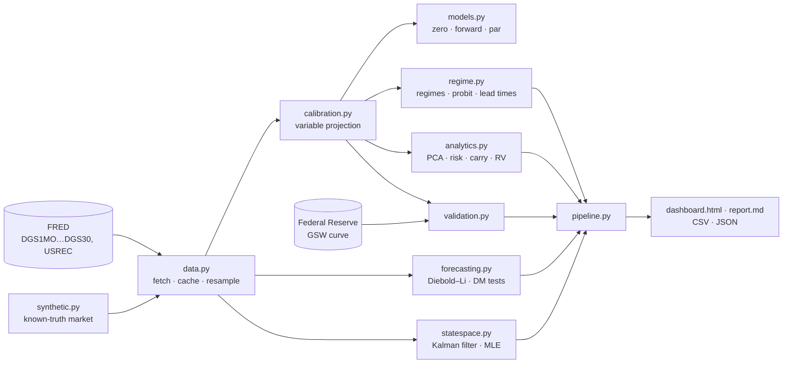

# NSS Yield Curve Engine

[](https://github.com/RblxDev-ALS/NSS-Yield-Curve-Engine/actions/workflows/ci.yml)
[](https://github.com/RblxDev-ALS/NSS-Yield-Curve-Engine/actions/workflows/live-dashboard.yml)


A Python engine that fits the **Nelson–Siegel–Svensson (NSS)** model to the U.S.
Treasury yield curve every week since 1990. It then uses the fitted curves to
measure the economy's position in the rate cycle, estimate recession risk,
forecast yields and price bond risk.

A yield curve is a set of numbers: what the government pays to borrow for
1 month, 3 months, … 30 years. The NSS model compresses that curve into six
parameters with economic meaning: the long-run **level** of rates, the **slope**
(long minus short, the famous recession signal), and two **curvature** terms.
Fitting those six numbers reliably, every week, is harder than it sounds. Most of
this project is about doing it robustly and proving that it works.

## Results on real Treasury data

From the latest run of the [live workflow](https://github.com/RblxDev-ALS/NSS-Yield-Curve-Engine/actions/workflows/live-dashboard.yml):
1,917 weekly curves, from January 1990 to 23 September 2026.

| | |
|---|---|
| Median fit error | **3.8 bp** (95th percentile 8.0 bp), 100% of fits converged |
| Agreement with the **Federal Reserve's own curve** (1–30Y zero rates) | RMSE **10.0 bp** with par fitting vs 16.3 bp reading quotes as zero rates. Weekly changes correlate 0.97 |
| Calibration speed | ~26 ms per curve (par fit), so 36 years of weekly curves take about 70 s |
| Model-implied vs observed 10Y−3M spread | correlation **0.999**, mean absolute gap 5 bp |
| Inversions detected (≥ 3 months, 10Y−3M) | 2000, 2006, 2019: each followed by a recession after **8, 18 and 10 months**. 2022–24: the deepest inversion in the sample (−1.8 pp, 25 months), with no recession so far |
| Recession prediction, **pseudo-real time** | out-of-sample AUC **0.71** for the near-term forward spread vs 0.61 for 10Y−3M (both 0.78 in sample) |
| Forecasts vs random walk | the random walk **wins** for every model at 1, 6 and 12 months (RMSE ratios 1.02–1.24) |

### The biggest fix in 2.0: the quotes are par yields

FRED's constant-maturity yields are **semi-annual par yields**. Version 1.x, like
Diebold & Li's classic setup, fitted the continuously compounded *zero* curve
straight to them. The in-sample fit cannot reveal the error: both fits match the
quotes equally well. The zero curve that comes out is still wrong. Checked
against the Federal Reserve's independently estimated Svensson curve
(Gürkaynak, Sack & Wright; off-the-run bonds, a different method), over 440
month-ends since 1990:

| reading of the quotes | RMSE vs the Fed | after removing each maturity's average gap | average gap at 20Y | 5y5y forward gap |
|---|---:|---:|---:|---:|
| as zero rates (1.x) | 16.3 bp | 12.0 bp | −18.5 bp | −21.8 bp |
| **as par yields (2.0 default)** | **10.0 bp** | **7.8 bp** | −9.7 bp | −14.5 bp |
| as par yields, robust fit | 11.0 bp | 8.7 bp | −10.8 bp | −15.1 bp |

The par fit is **38% closer** to the Fed's curve. The same correction on a
simulated market with a known truth cuts the error 59% (table below). What
remains is mostly a stable offset that is expected: the engine fits
**on-the-run** issues, which trade rich, while the Fed deliberately excludes
them.

The third row is a negative result. Robust fitting (Huber/bisquare
reweighting) works on simulated bad quotes, where it cuts the error from 11.5 to
3.1 bp. On real data it mostly rejects the **20-year bond** (13.6% of weeks) and
the on-the-run 10-year (4.7%). Those are persistent market features, not errors,
and ignoring them moves the curve *away* from the Fed's. So it is opt-in
(`--robust`).

### Recessions: a better signal, and an honest test

Every U.S. recession since the late 1960s was preceded by an inverted curve.
In-sample, the 10Y−3M probit has an AUC of 0.78. That flatters it: the model is
fitted on the same recessions it is scored on. The engine also runs a
**pseudo-real-time** test. Each month it re-estimates the probit using only
recessions already known, then scores the forecast it would have made (297
forecast months):

| signal | AUC in sample | AUC out of sample | log score (higher = better) | Brier |
|---|---:|---:|---:|---:|
| 10Y−3M spread (NY Fed) | 0.779 | 0.613 | −0.395 | 0.088 |
| **near-term forward spread** | 0.774 | **0.712** | **−0.302** | 0.091 |
| both | 0.786 | 0.503 | −0.543 | 0.103 |

The **near-term forward spread** (Engstrom & Sharpe, 2019) is read straight off
the NSS forward curve: the 3-month rate expected 18 months ahead minus today's.
It measures whether markets expect the Fed to *cut*, and out of sample it ranks
recession risk clearly better than the classic spread. Putting both signals in
one model looks best in sample and is the **worst** out of sample. With four
recessions since 1990 there is too little data for two slopes.

### Forecasting: the random walk still wins

Diebold & Li's model beat "no change" at 12-month horizons in their original
1985–2000 sample, but not since. A model that mean-reverts to a historical
average struggles through decades of falling rates and the zero lower bound. The
random walk is famously hard to beat (Duffee, 2002). 2.0 adds the **state-space
version** (Kalman filter, all parameters estimated jointly by maximum
likelihood; Diebold, Rudebusch & Aruoba, 2006). It improves on the two-step AR
model but still loses to no-change:

| model (re-estimated on past data only) | 1 month | 6 months | 12 months | 80% interval coverage (1 / 6 / 12m) |
|---|---:|---:|---:|---:|
| Diebold–Li, AR(1) factors | 1.112 | 1.072 | 1.090 | – |
| Diebold–Li, VAR(1) factors | 1.089 | **1.018** | **1.028** | – |
| state-space, VAR(1) | **1.088** | 1.029 | 1.048 | 86% / 79% / 73% |
| state-space, random-walk level | 1.103 | 1.062 | 1.073 | 85% / 79% / 77% |

(RMSE relative to the random walk, averaged over tenors; < 1 would beat it.)
The state-space intervals are well calibrated at short horizons and somewhat
too narrow at 12 months, because they ignore parameter uncertainty.

### Other findings

* **Raw NSS betas are not clean economic factors.** With the decay rates free,
  −β1 is a zero-to-infinity spread and correlates only 0.74 with the observed
  10Y−3M. Fixed-λ Diebold–Li factors correlate 0.995. So the regime engine reads
  the slope off the fitted curve (0.999) instead of using −β1.
* **The 20-year bond anomaly.** Since it was reintroduced in 2020, the 20-year
  has traded cheap relative to its neighbours (+9 bp above the fitted curve in
  the latest run).
* **Parameter uncertainty vs curve uncertainty.** Individual NSS betas have huge,
  strongly correlated standard errors. The fitted zero curve is pinned down to
  about ±10 bp (95%) at 2–10 years, and the band widens to ±22 bp at 30 years,
  where only one quote anchors it.

### Does NSS overfit? Leave-one-tenor-out cross-validation

In-sample error always favours the model with more parameters. The honest test
is out of sample: hide one maturity, fit the rest, and predict the hidden yield.
This uses 441 month-end curves from 1990 to 2026
([`benchmarks/real_data_studies.py`](benchmarks/real_data_studies.py)):

| model | out-of-sample RMSE, 3M–20Y (interpolation) | 30Y (extrapolation) |
|---|---:|---:|
| Nelson–Siegel (4 parameters) | 9.31 bp | **17.2 bp** |
| NSS, each date fitted independently | 8.69 bp | 23.9 bp |
| **NSS + λ smoothing (default)** | **8.34 bp** | 23.4 bp |
| NSS + λ smoothing, zero target (1.x) | 8.31 bp | 29.2 bp |

NSS's extra parameters genuinely help **between** quoted maturities (10% lower
out-of-sample error than Nelson–Siegel), and the smoothing penalty helps a
little more. **Beyond** the last quote the extra flexibility hurts: with the 30Y
hidden, NSS bends the long end more than the data supports, so for
extrapolation the simpler model is safer. Par fitting cuts that 30Y
extrapolation error from 29.2 to 23.4 bp.

To reproduce: `nss-engine run --source fred --start 1990-01-01` and
`python benchmarks/real_data_studies.py`.

## What it does

| | |
|---|---|
| **Data** | Downloads the 11 constant-maturity Treasury series (1M–30Y) and NBER recession dates from FRED. No API key is needed. Downloads are cached, retried, and fall back to the cache if FRED is down. |
| **Calibration** | Fits **par yields**, which is how FRED quotes Treasuries. It uses a variable-projection global search over the decay parameters with multi-start par refinement and an analytic Jacobian (details below). It handles missing tenors, gives confidence bands on the fitted curve, and can optionally down-weight bad quotes (`--robust`). |
| **Curves** | Zero, instantaneous forward, discount and par curves in closed form. |
| **Macro regimes** | The model-implied 10Y−3M slope is classified as Inverted / Flat / Normal / Steep, with hysteresis. It also labels bull/bear steepeners and flatteners, and measures inversion-to-recession lead times. |
| **Recession model** | A probit on the slope, $P(\text{recession in 12m}) = \Phi(a + b\cdot\text{spread})$ (the NY Fed specification), fitted on NBER data. It is compared with the **near-term forward spread** (Engstrom & Sharpe, 2019) in a **pseudo-real-time** test that only uses recessions known at each date. |
| **Forecasting** | The Diebold–Li dynamic Nelson–Siegel model, and its **state-space version** (Kalman filter, maximum likelihood, Diebold–Rudebusch–Aruoba 2006), which also gives forecast intervals. Both are evaluated **out of sample** against a random walk. |
| **Risk** | Bond pricing off the curve, plus DV01, duration, convexity, key-rate durations and **factor durations** (exposure to level/slope/curvature). |
| **Relative value** | Rich/cheap residuals, rolling z-scores with no look-ahead, mean-reversion half-lives, and carry and roll-down. |
| **Validation** | Every run is compared with the **Federal Reserve's own Svensson curve** (Gürkaynak–Sack–Wright). There is also PCA of yield changes against the NSS loadings, and correlations with model-free factor proxies. |
| **Outputs** | An interactive dashboard (light/dark), a Markdown report, CSV/JSON exports and a CLI. A scheduled GitHub Action rebuilds it all from live data. |

## Quick start

```bash
git clone https://github.com/RblxDev-ALS/NSS-Yield-Curve-Engine.git
cd NSS-Yield-Curve-Engine
pip install -e .            # or: pip install -r requirements.txt

nss-engine run              # full pipeline on FRED data since 1990 -> ./output
nss-engine curve            # fit and print today's curve
nss-engine run --source synthetic   # offline demo on a simulated market
```

`nss-engine run` writes `output/dashboard.html` (open it in a browser), plus
`report.md`, `summary.json`, `nss_parameters.csv`, `fitted_yields.csv`,
`residuals_bp.csv`, `macro_signals.csv` and `reference_comparison.csv`. Useful
flags: `--robust` (down-weight bad quotes), `--target yield` (the 1.x behaviour:
fit zero rates directly to the quotes), `--model ns`, `--start 2000-01-01`,
`--freq ME` (monthly), `--no-forecast`, `--no-reference` (skip the Fed
comparison), `--offline` (embed plotly.js so the dashboard opens without internet).

As a library:

```python
import numpy as np
from nss_engine import calibrate, calibrate_panel
from nss_engine.data import load_treasury_yields

yields = load_treasury_yields(start="2020-01-01")          # weekly panel, columns = maturities
fit = calibrate_panel(yields)                               # one NSS curve per week
curve = fit.curve(-1)                                       # latest curve
curve.zero([2, 10]), curve.forward(5), curve.par_yield(30)  # evaluate it anywhere
fit.spread(10, 0.25)                                        # model-implied 10y-3m history

one = calibrate(yields.columns, yields.iloc[-1])            # a single date, full diagnostics
one.confidence_band([2, 10, 30])                            # 95% band on the zero curve
one.standard_errors(), one.leverage, one.sigma_bp

from nss_engine import compare_to_reference, fit_dns
from nss_engine.data import load_gsw_parameters
compare_to_reference(fit, load_gsw_parameters()).summary()  # vs the Fed's curve, by maturity
dns = fit_dns(yields.resample("ME").mean())                 # Kalman-filter DNS model
mean, cov = dns.forecast(12)                                # 12-month predictive distribution
```

See [`examples/quickstart.py`](examples/quickstart.py) for risk, carry and uncertainty analytics.

## How the calibration works

The NSS zero curve is

$$
z(\tau) = \beta_0 + \beta_1\,\frac{1-e^{-\lambda_1\tau}}{\lambda_1\tau}
+ \beta_2\left(\frac{1-e^{-\lambda_1\tau}}{\lambda_1\tau}-e^{-\lambda_1\tau}\right)
+ \beta_3\left(\frac{1-e^{-\lambda_2\tau}}{\lambda_2\tau}-e^{-\lambda_2\tau}\right)
$$

so $z(\infty)=\beta_0$ (level), $z(0)=\beta_0+\beta_1$ (short rate), and the
long-minus-short slope is $-\beta_1$.

Fitting all six parameters with a generic optimizer is fragile. The error surface
has several local minima and long flat valleys, and the two curvature terms become
collinear when $\lambda_1\approx\lambda_2$. The key observation is that **for
fixed decay rates the model is linear in the betas**. So:

1. **Closed-form betas.** For any $(\lambda_1,\lambda_2)$ the optimal betas come
   from a weighted ridge regression. That turns a 6-D problem into a 2-D one.
2. **Global search.** An exhaustive, vectorized grid over $\log\lambda$ finds
   every basin of the 2-D surface.
3. **Local refinement from every basin.** SLSQP runs from each grid-local
   minimum. Thanks to the envelope theorem the gradient is analytic and needs no
   derivative of the betas.
4. **Identification.** The constraint $\lambda_1 \ge 1.5\lambda_2$ and the bounds
   keep the two humps apart and inside the 1M–30Y range. The ridge and
   week-to-week $\Delta\log\lambda$ penalties were tuned against the *true* curve
   on synthetic data, not against in-sample fit.
5. **Par yields.** The quotes are par yields, not zero rates. The par objective is
   not separable, so the grid search above runs on *convexity-adjusted* quotes.
   Every basin it finds is then refined in par space with an analytic Jacobian,
   including the stub coupon and accrued interest for off-grid maturities.
   Refining only one start landed in a worse basin on 7% of dates. The
   multi-start matches a brute-force search.

The full derivations (forward rates, par yields, the gradient, the probit,
Diebold–Mariano, factor durations) are in
**[docs/methodology.md](docs/methodology.md)**.

## Testing and validation

Real market data has no "right answer", so the engine includes a **synthetic
Treasury market** with known true parameters. It follows a dynamic NSS model with
a zero lower bound and realistic inversions. The tests and benchmarks can then
check correctness, not just that the code runs.

* **163 tests, 96% coverage**, on Python 3.10–3.13 in CI, with `ruff` and `mypy`.
* **Math identities**: the forward curve integrates back to the zero curve, par
  bonds price at exactly 100, key-rate durations sum to duration, and the level
  factor duration equals duration.
* **Global optimality**: the calibrator's loss must be no worse than an
  exhaustive 300 × 300 brute-force grid.
* **Property-based tests** (Hypothesis) generate random curves and require them
  to be recovered. This found two real bugs, where the true optimum sat in a basin
  narrower than the search grid. Those cases led to the "refine every basin"
  design, which was then stress-tested on 1,500 random curves.
* **Statistics**: the probit matches an independent SciPy MLE, the VAR recovers
  known coefficients, the Diebold–Mariano test detects a known accuracy gap, and
  the rolling z-scores are checked for look-ahead.
* **Jacobians** (par operator and full residual vector, for NSS, NS, fixed λ and
  smoothing) agree with finite differences to 1e-8.
* **Confidence bands** reach 93–97% coverage for a nominal 95% in a Monte Carlo test.
* **Kalman filter**: the fast steady-state filter matches a textbook
  covariance-form filter to 1e-9, with missing tenors and blank dates. The MLE
  recovers known parameters.
* **No look-ahead in the recession evaluation**: scrambling every outcome that
  was not yet known at a forecast date leaves that forecast unchanged.

## Benchmark: 2.0 vs. 1.x vs. the original algorithm

`benchmarks/compare_legacy.py` reruns the original (v0) calibration routine
unchanged and compares it with 1.x and 2.0. The test uses a synthetic market
where the **true** curves are known and the quotes are par yields, like FRED's:
3 seeds × 10 years of weekly curves, with 3 bp of quote noise.

| method | fit RMSE | error vs **true** curve | worst 1% error vs truth |
|---|---:|---:|---:|
| v0: 6-D L-BFGS-B + ridge 0.005 (original) | 5.57 bp | 8.01 bp | 15.0 bp |
| v0 without the ridge penalty | 2.56 bp | 6.17 bp | 12.7 bp |
| 1.x: variable projection + λ smoothing, zero target | 2.15 bp | 5.74 bp | 12.4 bp |
| 2.0: par target, each week independent | 1.98 bp | 2.58 bp | 5.8 bp |
| **2.0: par target + λ smoothing (default)** | 2.15 bp | **2.37 bp** | **5.3 bp** |

* **2.0's curves are 59% closer to the truth than 1.x's, and 70% closer than
  v0's**, with worst cases more than halved. The in-sample fit is the same as
  1.x (2.15 bp). What changed is that par quotes are no longer read as zero
  rates, a bias the in-sample fit cannot reveal.
* v0's penalty was larger than the fitting error itself, so it flattened genuine
  curvature. Removing it is not enough on its own: the local optimizer then
  lands in worse basins.
* The smoothing penalty *raises* in-sample RMSE slightly but *lowers* the error
  against the truth. The extra in-sample fit was fitting noise.
* A 2.0 par fit takes about 20 ms per weekly curve (1.x's zero fit took 10 ms).

## Architecture



```
src/nss_engine/
  models.py        NS/NSS curves: stable loadings, zero/forward/discount/par
  calibration.py   variable-projection calibrator, panel fitting
  data.py          FRED client, caching, CSV loading, resampling
  synthetic.py     simulated market with known parameters
  analytics.py     PCA, bond risk, factor durations, carry, rich/cheap
  regime.py        regimes, curve dynamics, inversions, probit recession model
  forecasting.py   Diebold-Li model, out-of-sample evaluation, Diebold-Mariano
  statespace.py    state-space DNS: Kalman filter, MLE, predictive intervals
  validation.py    comparison with a reference curve (the Fed's GSW curve)
  pipeline.py      end-to-end run and exports
  report.py, viz.py, cli.py
tests/             163 tests (incl. a real market curve)
benchmarks/        v0 / 1.x / 2.0 comparison, regularization tuning, real-data studies
docs/              methodology and references
```

## Limitations

* Constant-maturity yields are interpolated par yields of on-the-run securities,
  not prices of individual bonds. Residuals are a curve-shape signal, not
  directly tradeable mispricings.
* NSS is a statistical curve, not an arbitrage-free model (see AFNS,
  Christensen–Diebold–Rudebusch 2011).
* The recession probit rests on a handful of recessions (four since 1990). Treat
  its probabilities as indicative. The 2022–2024 inversion, for example, was not
  followed by an NBER recession within the usual window.
* Confidence bands and forecast intervals reflect estimation noise under the
  model. They do not cover model misspecification, and the forecast intervals
  ignore parameter uncertainty.

## Background

This project started as a sophomore-year script: a Nelson–Siegel fit to FRED data
with a 3-D Plotly surface. Version 1.0 rebuilt it from the ground up. Version
2.0 fits the quotes as what they are (par yields), checks the result against the
Federal Reserve's curve, and adds robust fitting, uncertainty, a state-space
model and real-time recession tests. The [CHANGELOG](CHANGELOG.md) lists what
was wrong in each version and how it was fixed.

## References

Nelson & Siegel (1987); Svensson (1994); Diebold & Li (2006); Gilli, Große &
Schumann (2010); Estrella & Mishkin (1998); Litterman & Scheinkman (1991);
Diebold & Mariano (1995); Willner (1996); Gürkaynak, Sack & Wright (2007);
Diebold, Rudebusch & Aruoba (2006); Engstrom & Sharpe (2019); Huber (1964).
Full citations are in
[docs/methodology.md](docs/methodology.md#references).

*Data: Board of Governors of the Federal Reserve System, H.15 Selected Interest
Rates, via FRED (Federal Reserve Bank of St. Louis); NBER business cycle dates.
Educational project, not investment advice.*
