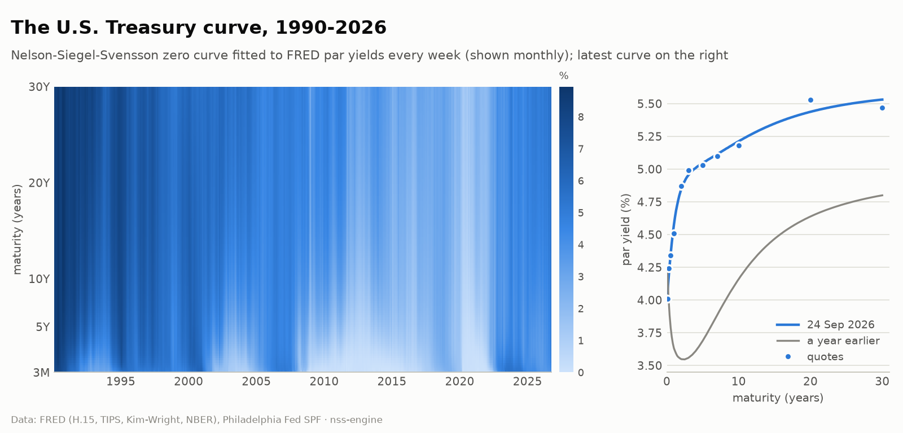
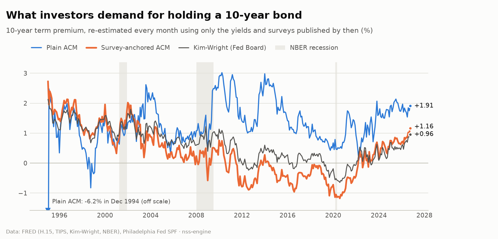
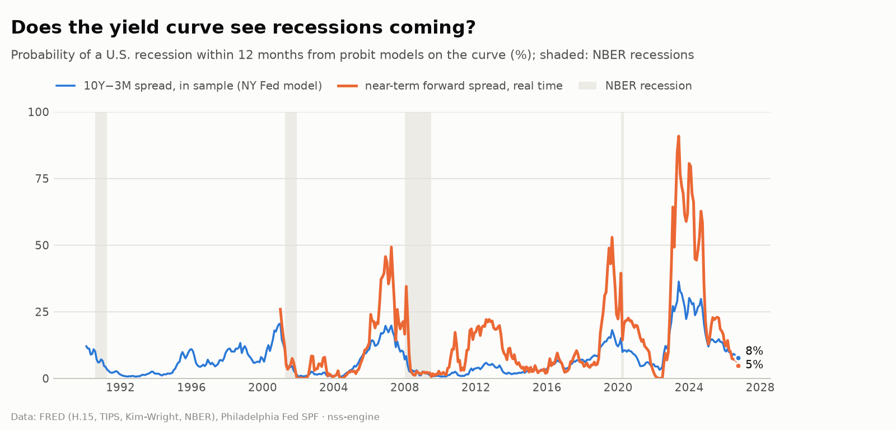

# NSS Yield Curve Engine

[](https://github.com/RblxDev-ALS/NSS-Yield-Curve-Engine/actions/workflows/ci.yml)
[](https://github.com/RblxDev-ALS/NSS-Yield-Curve-Engine/actions/workflows/live-dashboard.yml)
[](https://pypi.org/project/nss-engine/)
[](LICENSE)
[](https://colab.research.google.com/github/RblxDev-ALS/NSS-Yield-Curve-Engine/blob/main/examples/tour.ipynb)

Fits the U.S. Treasury yield curve every week since 1990 and splits it into
the parts people argue about: where the Fed is expected to take rates, the
term premium, inflation expectations and recession odds. Each estimate is
checked on a simulated market where the answer is known, then against the
Federal Reserve's own numbers.

[](https://rblxdev-als.github.io/NSS-Yield-Curve-Engine/dashboard.html)
[](https://rblxdev-als.github.io/NSS-Yield-Curve-Engine/dashboard.html)
[](https://rblxdev-als.github.io/NSS-Yield-Curve-Engine/)

[Website](https://rblxdev-als.github.io/NSS-Yield-Curve-Engine/) ·
[Live dashboard](https://rblxdev-als.github.io/NSS-Yield-Curve-Engine/dashboard.html) ·
[Results](docs/results.md) · [Methodology](docs/methodology.md) ·
[Research note](docs/par-vs-zero.md) · [Changelog](CHANGELOG.md)

<picture>
  <source media="(prefers-color-scheme: dark)" srcset="docs/img/curve-dark.png">
  
</picture>

A Nelson–Siegel–Svensson curve fitted to FRED's Treasury yields every week
since 1990. The pale stretches are the zero-rate years.

<picture>
  <source media="(prefers-color-scheme: dark)" srcset="docs/img/term_premium-dark.png">
  
</picture>

The 10-year term premium as it would have been estimated at each date,
using only data published by then. The textbook model (ACM, blue) swings with
every re-estimation and sits about a point above the Fed Board's Kim–Wright
estimate (grey). Anchoring its expected rates to the Survey of Professional
Forecasters (orange) makes it stable and brings it much closer to Kim–Wright.
On 24 September 2026: a 5.18% ten-year zero yield = 4.02% expected short rate
+ 1.16% term premium.

<picture>
  <source media="(prefers-color-scheme: dark)" srcset="docs/img/recession-dark.png">
  
</picture>

Recession odds from the curve, in sample and in pseudo-real time (only
recessions known at each date). The 2022–24 inversion pushed the real-time
model to 90% and no recession has followed so far. Four recessions since 1990
are not much to learn from.

## Install

```bash
pip install nss-engine
nss-engine run          # FRED data since 1990 -> output/dashboard.html, report.md, CSVs
```

No API key is needed. `pip install "nss-engine[surveys]"` adds the survey
anchors (it reads the Philadelphia Fed's Excel files), `[figures]` the PNG
charts. Or run the [Colab notebook](https://colab.research.google.com/github/RblxDev-ALS/NSS-Yield-Curve-Engine/blob/main/examples/tour.ipynb)
in a browser, or `nss-engine run --source synthetic` offline.

## What it finds

From the latest run of the live workflow on FRED data (1990–2026). Details,
tables and tests are in **[docs/results.md](docs/results.md)**.

- **Fitting the curve.** Median error 3.8 bp over 1,917 weekly curves, and
  10.0 bp from the Federal Reserve's own curve, against 16.3 bp the textbook
  way. FRED's yields are *par* yields, not the zero rates most Nelson–Siegel
  code assumes ([research note](docs/par-vs-zero.md)).
- **Term premium.** The survey-anchored 10-year premium is within 28 bp RMSE
  of Kim–Wright (plain ACM: 123 bp) and tracks a model-free survey premium
  best (correlation 0.89). Estimated in real time it agrees 0.91–0.94 with
  its own full-sample series; plain ACM 0.43–0.70.
- **Breakeven inflation.** Against the Fed's own TIPS curve, the engine's
  5y5y breakeven is closer (20 bp RMSE) than FRED's published `T5YIFR` (27 bp,
  9 bp too low on average). On simulated markets it beats FRED's formulas at
  every maturity.
- **Recessions.** The near-term forward spread beats the classic 10Y−3M
  spread out of sample (AUC 0.71 vs 0.61), but with three recessions to
  score, the 90% interval on the gain includes zero.
- **Forecasts.** Every model loses to "no change" at 1 month
  (Diebold–Mariano p < 0.001); half model, half random walk only ties it at
  6–12 months (p ≥ 0.49).

Several things did not work, and the results page keeps them: robust
fitting moves the curve *away* from the Fed's, bias-corrected VARs make the
real-time premium worse, splitting the slope into expectations and term
premium (Rosenberg & Maurer) predicts recessions worse than the plain spread
since 2005, and the arbitrage-free model's forecast intervals are
significantly too wide.

## What it does

- Data: FRED's 11 Treasury constant-maturity yields, TIPS real yields,
  NBER recessions and Kim–Wright; the Fed's GSW nominal and TIPS curves; the
  New York Fed's ACM term premium; the Philadelphia Fed's SPF. Cached, retried, and read from the cache when a
  source is down.
- Calibration: NSS fitted to par yields by variable projection, an
  exhaustive grid over the decay rates and multi-start refinement with an
  analytic Jacobian, with confidence bands and optional robust fitting.
  About 26 ms per curve.
- Term premium: Adrian–Crump–Moench, plain or with expectations anchored
  to surveys (the default) or bias-corrected; full sample and re-estimated
  month by month; checked against the New York Fed's published series and
  against the excess returns bonds went on to earn.
- Inflation: TIPS real curve, zero-coupon and 5y5y forward breakevens,
  compared with FRED and the Fed.
- Recessions: NY Fed-style probit, the near-term forward spread
  (Engstrom & Sharpe) and expectations vs premium (Rosenberg & Maurer), all
  scored in pseudo-real time with block-bootstrap intervals.
- Forecasting: Diebold–Li, state-space (Kalman filter, MLE) and
  arbitrage-free (AFNS) dynamic Nelson–Siegel against the random walk, with
  Diebold–Mariano and coverage tests.
- Risk and relative value: duration, convexity, key-rate and factor
  durations, carry and roll-down, rich/cheap z-scores without look-ahead.
- Outputs: interactive dashboard (light/dark), Markdown report,
  CSV/JSON, PNG charts, shields.io badges, and a website rebuilt from live
  data every weekday.

## As a library

```python
from nss_engine import calibrate_panel, fit_acm, zero_panel
from nss_engine.data import load_treasury_yields, load_spf_bill_forecasts

yields = load_treasury_yields(start="1990-01-01")      # weekly, columns = maturities (years)
fit = calibrate_panel(yields)                          # one NSS curve per week
curve = fit.curve(-1)                                  # the latest curve
curve.zero([2, 10]), curve.forward(5), curve.par_yield(30)

acm = fit_acm(zero_panel(fit.params), surveys=load_spf_bill_forecasts())
acm.decomposition(10).tail()                           # yield = expected short rate + term premium

from nss_engine.data import load_tips_yields
from nss_engine.inflation import breakevens, fit_real_curve
real = fit_real_curve(load_tips_yields())              # TIPS real curve, weekly since 2003
breakevens(fit.params, real.params).tail()             # 5Y, 10Y and 5y5y breakeven inflation

from nss_engine.returns import excess_returns
zeros = zero_panel(fit.params)
excess_returns(zeros).tail()                           # what 2/5/10-year bonds earned over bills
acm.expected_excess_returns().tail()                   # what the model expected them to earn
```

More in [`examples/quickstart.py`](examples/quickstart.py) (risk, carry,
uncertainty bands) and the [notebook](examples/tour.ipynb).

## How it is tested

Real market data has no "right answer", so every model is first checked on a
simulated market with a known truth: a dynamic NSS market for the
calibrator, an arbitrage-free affine market with a known term premium and
simulated surveys, and a TIPS market with a known breakeven curve. Then it is
checked against independent estimates on real data: the Fed's curves,
Kim–Wright, FRED's breakevens.

* Unit, property-based (Hypothesis) and statistical tests on Python 3.10–3.13,
  Linux and Windows, pandas 2 and 3, with `ruff` and `mypy`.
* Math identities (forward curves integrate to zero curves, par bonds price
  at 100, key-rate durations sum to duration), a brute-force check of the
  calibrator's global optimum, Jacobians against finite differences, and
  Kalman filters against a textbook implementation.
* No look-ahead: scrambling every outcome, yield or survey published after
  a date leaves that date's real-time estimate unchanged.

## How the calibration works

For fixed decay rates the NSS model is linear in its four betas, so the
six-parameter fit becomes a two-dimensional search: closed-form betas for any
$(\lambda_1, \lambda_2)$, an exhaustive grid over that plane to find every
basin, then a local par-yield refinement from each basin with an analytic
gradient. Constraints keep the two humps apart and inside the quoted
maturities; a week-to-week penalty on the decay rates, tuned against the true
curve on simulated data, keeps the parameters stable. Details, derivations
and every other model are in [docs/methodology.md](docs/methodology.md).

## Limitations

* Constant-maturity yields are interpolated on-the-run par yields, not prices
  of individual bonds: residuals are a curve-shape signal, not tradeable
  mispricings.
* The term premium depends on the model; survey anchors help only as far as
  the surveys are right. Breakevens include risk and liquidity premia.
* Four recessions since 1990 are too few to be sure which signal is best, and
  the 2022–24 inversion has not been followed by a recession.
* Forecast intervals ignore parameter uncertainty and model misspecification.

## Background

This started as a sophomore-year script: a Nelson–Siegel fit to FRED data with
a 3-D Plotly surface. 1.0 rebuilt it; 2.0 fitted the quotes as what they are
(par yields) and checked the result against the Federal Reserve; 2.1 put error
bars on the headline claims and withdrew one; 2.2 added the term premium and
arbitrage-free dynamics; 2.3 survey anchors and significance tests; 2.4
breakeven inflation and this website. The [CHANGELOG](CHANGELOG.md) lists what
was wrong in each version and how it was fixed.

If you use it, please cite it ([CITATION.cff](CITATION.cff)). References are
in [docs/methodology.md](docs/methodology.md#references).

*Data: Board of Governors of the Federal Reserve System (H.15, GSW curves,
Kim–Wright), via FRED (Federal Reserve Bank of St. Louis); Federal Reserve Bank
of Philadelphia (Survey of Professional Forecasters); NBER. MIT license.
Educational project, not investment advice.*
